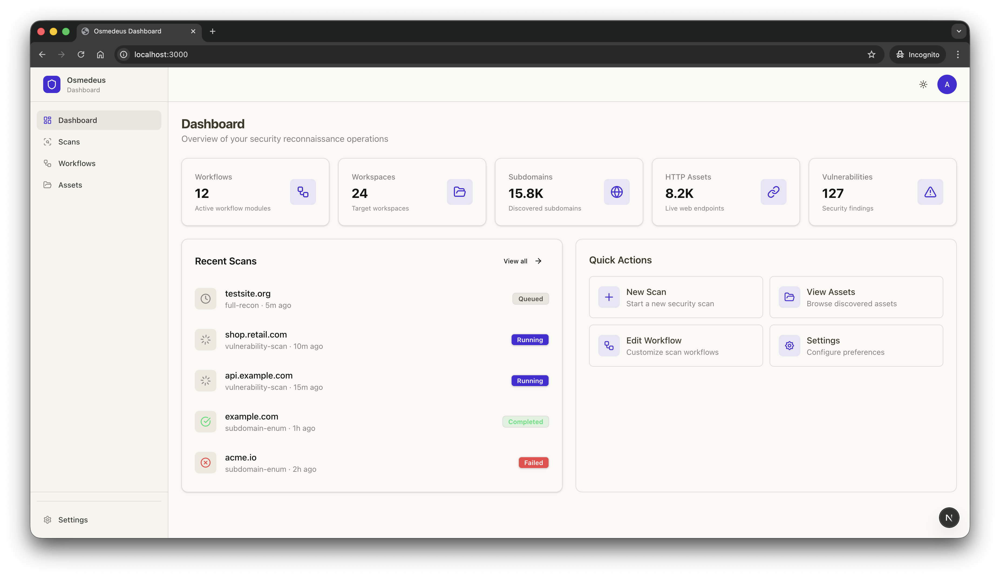
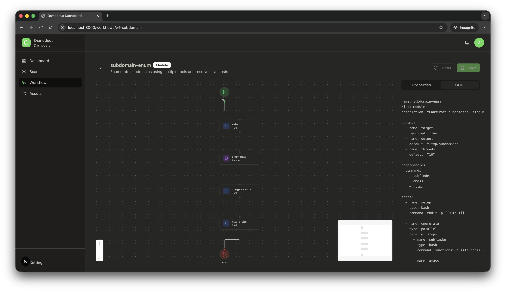
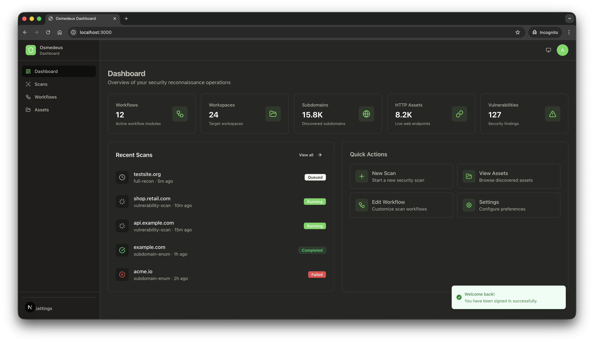

# Osmedeus Dashboard

UI dashboard for the Osmedeus Workflow Engine, built with Next.js App Router, Tailwind CSS v4, and Shadcn UI.

For a codebase architecture overview, see `AGENTS.md`.


|     |     |     |
| --- | --- | --- |
|  |  |  |


## What’s included

- App Router route groups:
  - `app/(auth)/` (login)
  - `app/(dashboard)/` (authenticated dashboard routes)
- Mock authentication (client-side session in `localStorage` under `osmedeus_session`)
- Mock API layer (`lib/api/*`) backed by in-memory data in `lib/mock/data/*`
- Workflow editor (`/workflows/[id]`) that parses YAML and renders a graph using `@xyflow/react`

## Tech stack

- Next.js (`next`) + React
- Tailwind CSS v4 (`tailwindcss`) with CSS variables in `app/globals.css`
- Shadcn UI (configured in `components.json`)
- Theme switching via `next-themes`
- Workflow editor: `@xyflow/react` + `js-yaml` + `dagre`
- Toasts: `sonner`

## Quickstart

Install deps:

```bash
bun install
```

Run dev server (Turbopack):

```bash
bun dev
```

Build and start:

```bash
bun run build
bun run start
```

Lint:

```bash
bun run lint
```

## Authentication (demo)

Auth is mocked in `providers/auth-provider.tsx`:

- Session stored in `localStorage` under `osmedeus_session`.
- Accepts:
  - `admin` / `admin`
  - any username with a password length of 4+ characters

## API layer (mocked)

API modules live in `lib/api/*` and currently return mock data from `lib/mock/data/*`.

- Base URL is configured via `NEXT_PUBLIC_API_URL` (fallback `http://localhost:8080/api`) in `lib/api/client.ts`.
- To integrate real APIs, replace the mock implementations in `lib/api/*.ts`.

## Testing

No test framework is configured (there is no `test` script in `package.json`).

## Shadcn UI components

Shadcn primitives are under `components/ui/`. The repo guidance is to add/update primitives via the Shadcn CLI:

```bash
bunx shadcn@latest add <component>
```
